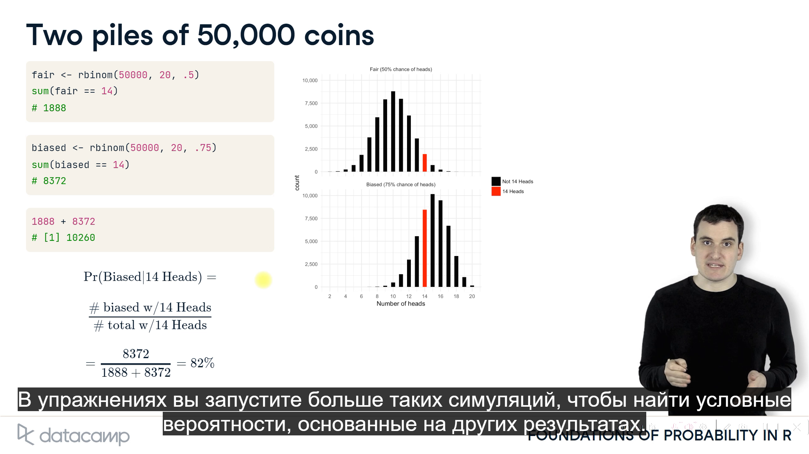

# DataCamp_Foundation to probability

::: {.callout-caution appearance="simple"}
**Probability theory** - это раздел математики, который занимается анализом случайных явлений. 
Фундаментальным объектом теории вероятностей является случайная величина, представляющая собой величину, результат которой неопределен. 
Теория вероятностей позволяет нам делать прогнозы относительно вероятности различных исходов, начиная от простого подбрасывания монеты и заканчивая сложными взаимодействиями частиц в физике.
:::

# 1. The binomial distribution


::: {.callout-tip appearance="simple"}
Transcript:

1.  **Плотность и кумулятивная плотность** 00:00 - 00:23

    Когда вы подбрасываете честную монету десять раз, каково наиболее вероятное количество орлов?
    Ну, поскольку орел и решка одинаково вероятны, вы, вероятно, можете вычислить, что наиболее вероятный исход заключается в том, что выпадет 5 орлов, 5 решек.
    Допустим, я предлагаю вам пари: если это именно такой результат, я заплачу вам доллар, в противном случае вы заплатите мне доллар.
    Стоит ли вам принимать ставку?

2.  **Моделирование множества исходов** 00:23 - 01:33

    Чтобы ответить на этот вопрос, нам нужно найти вероятность того, что биномиальная переменная X с этими параметрами - десять переворотов, каждый с вероятностью 50% - приведет к результату, равному 5.
    Мы бы выразили это как "Pr X равно 5".
    Один из способов выяснить это - смоделировать множество розыгрышей из X - скажем, сто тысяч: а затем посмотреть, насколько распространен каждый исход.
    Как вы видели в предыдущих упражнениях, вы можете выбрать количество выполняемых симуляций, установив первый аргумент 'rbinom'.
    Результирующая переменная 'flips' затем содержит результаты этих ста тысяч розыгрышей.
    Мы не можем распечатать все эти результаты, по крайней мере, не в том виде, в котором мы их поймем.
    Вместо этого мы можем визуализировать их в виде графика.
    Этот график называется гистограммой: каждая полоска показывает относительную частоту одного исхода, от 0, 1, 2 до 10.
    Гистограммы - это распространенный способ изучения распределения вероятностей, и мы будем часто использовать их на протяжении всего курса.
    Обратите внимание, что из этих ста тысяч розыгрышей около двадцати пяти тысяч равны 5.

3.  **Определение плотности с помощью моделирования** 01:33 - 02:23

    В R есть полезный трюк для непосредственного вычисления доли, равной 5.
    Выражение flips == 5 сравнивает каждый элемент в векторе с 5.
    Затем мы можем использовать функцию mean(), чтобы найти долю сравнений, которые являются истинными.
    Это работает, потому что функция mean обрабатывает значение TRUE как 1, а значение FALSE как 0.
    Таким образом, "среднее значение переворачивается == 5" дает долю значений, равную 5.
    В этих упражнениях вы будете использовать этот трюк со средним значением много всякий раз, когда будете оценивать значения с помощью моделирования.
    В этом случае мы обнаружили, что доля исходов, равная 5, составила 2463 балла: то есть вероятность составляет 24,6%.
    Это называется плотностью бинома в данной точке.

4.  **Вычисление точной плотности вероятности** 02:23 - 03:15

    Моделирование - очень полезный способ понять распределение и ответить на вопросы о его поведении.
    Но в случае биномиального распределения R также предоставляет способ вычисления точной плотности вероятности, используя функцию 'dbinom'.
    'dbinom' принимает три аргумента: результат, который мы оцениваем как плотность, равный 5, количество монет, равное 10, и вероятность того, что каждая из них окажется орлом, равная 5 очкам.
    Обратите внимание, что это дает результат точки-246: это подтверждает результат нашего моделирования, согласно которому вероятность составляет около 24,6%.
    Аналогичным образом, мы могли бы рассчитать плотность вероятности выпадения ровно шести орлов или всех десяти монет, являющихся орлами, изменив первый аргумент.
    Определение вероятности как с помощью моделирования, так и с помощью точного расчета будет обычной задачей в этом курсе.

5.  **Кумулятивная плотность (cumulative density)** 03:15 - 04:34

    Итак, теперь вы знаете, что не стоит принимать мою ставку: скорее всего, я не получу ровно 5 орлов из 10.
    Что, если я предложу новую?
    Я заплачу вам доллар, если выпадет 4 орла или меньше, в противном случае вам придется заплатить мне.
    Это описывает совокупную плотность бинома, вероятность X меньше или равна 4, и процесс ее вычисления аналогичен вычислению плотности.
    Вы можете оценить это с помощью моделирования: мы бы сгенерировали сто тысяч розыгрышей из биномиального распределения, затем вместо использования "равно равно" мы бы сделали "среднее значение переворотов меньше или равно 4".
    Мы можем видеть, что это было верно примерно для 37,7% симуляций.
    Так же, как и для плотности, R предоставляет функцию для получения точной суммарной плотности бинома.
    Вместо dbinom используйте pbinom.
    Этот результат подтверждает, что вероятность того, что биномиал с десятью переворотами получит 4 орла или меньше, составляет около 37,7%.
    Другими словами, вам все равно не следует принимать мою ставку.
    В своих упражнениях вы найдете плотность и кумулятивную плотность нескольких других биномиальных распределений, используя как подход моделирования, так и функции dbinom и pbinom.
:::

```{r simulate_coin_toss}
# "Вероятность выпадения орла при разном размере выборки"

# Функция для моделирования броска монеты
simulate_coin_toss <- function(probability, size) {
  mean(rbinom(10, size, probability) / size)
}

# Загрузка необходимых библиотек
library(ggplot2)

# Создание данных
sample_sizes <- seq(10, 8000, 10)
constant_probability <- 0.5

# Расчет вероятности выпадения орла для постоянной вероятности
probability_heads <- sapply(sample_sizes, function(size) simulate_coin_toss(constant_probability, size))

# Создание фрейма данных
data <- data.frame(sample_sizes = rep(sample_sizes, each = length(constant_probability)),
                   constant_probability = rep(constant_probability, times = length(sample_sizes)),
                   probability_heads = probability_heads)

# Построение графика с использованием ggplot2
ggplot(data, aes(x = sample_sizes, y = probability_heads)) +
  geom_line(color = "darkgreen") +
  labs(title = "Вероятность выпадения орла при разном размере выборки",
       x = "Количество монет", y = "Вероятность выпадения орла") +
  theme_minimal()

```

### Вычисление плотности бинома

::: {.callout-tip appearance="simple"}
Если вы подбрасываете 10 монет, каждая из которых с вероятностью 30% выпадет орлом, какова вероятность того, что ровно 2 из них окажутся орлами?

-   Ответьте на приведенный выше вопрос, используя функцию `dbinom()`.
    Эта функция принимает почти те же аргументы, что и `rbinom()`.
    Вторым и третьим аргументами являются `size` и `prob`, но теперь первым аргументом является `x` вместо `n`.
    Используйте `x`, чтобы указать, где вы хотите оценить биномиальную плотность.

-   Подтвердите свой ответ с помощью функции `rbinom()`, создав симуляцию из 10 000 испытаний.
    Поместите все это в одну строку, обернув функцию `mean()` вокруг функции `rbinom()`.
:::

```{r}
# rbinom (количество ипытаний, количество монет, вероятность)
mean(rbinom(10000, 10 , .3) == 2)

# dbinom ( x, size, prob)
dbinom(2, 10, .3)
```

### Вычисление биномиальной кумулятивной плотности

::: {.callout-tip appearance="simple"}
Если вы подбросите десять монет, каждая из которых с вероятностью 30% выпадет орлом, какова вероятность того, что по крайней мере пять из них окажутся орлом?

-   Ответьте на приведенный выше вопрос, используя функцию `pbinom()`.
    (Обратите внимание, что вы можете вычислить вероятность того, что количество головок меньше или равно 4, затем принять 1 - эту вероятность).

-   Подтвердите свой ответ с помощью моделирования 10 000 испытаний, найдя количество испытаний, в результате которых было получено 5 или более голов.
:::

```{r}
# Calculate the probability that at least five coins are heads

1 - pbinom(4, 10, .3)

mean(rbinom(10000, 10, 0.3) >= 5)
# Confirm your answer with a simulation of 10,000 trials
```

### Изменение количества испытаний

::: {.callout-tip appearance="simple"}
В последнем упражнении вы пытались подбросить десять монет с вероятностью выпадения орла 30%, чтобы определить вероятность выпадения по крайней мере пяти орлов.
Вы обнаружили, что точный ответ был равен \`1 - pbinom(4, 10, .3) = 0,1502683, затем подтвержден с помощью 10 000 смоделированных испытаний.

Понадобились ли вам все 10 000 испытаний, чтобы получить точный ответ?
Был бы ваш ответ более точным при большем количестве испытаний?

-   Попробуйте ответить на этот вопрос с помощью моделирования 100, 1000, 10 000, 100 000 испытаний.

-   Какой из них ближе всего к точному ответу?
:::

```{r}
# Here is how you computed the answer in the last problem
mean(rbinom(10000, 10, .3) >= 5)

# Try now with 100, 1000, 10,000, and 100,000 trials
mean(rbinom(100, 10, .3) >= 5)
mean(rbinom(1000, 10, .3) >= 5)
mean(rbinom(10000, 10, .3) >= 5)
mean(rbinom(100000, 10, .3) >= 5)
mean(rbinom(1000000, 10, .3) >= 5)
```

### Expected values and Variance


::: {.callout-tip appearance="simple"}
Transcript:

1.  Ожидаемое значение и отклонение 00:00 - 00:08

    Когда мы говорим о распределении вероятностей, нам часто интересно обобщить его в виде нескольких описательных статистических данных.

2.  Свойства распределения 00:08 - 00:20

    Два наиболее интересных свойства - это то, где сосредоточено распределение и насколько широко оно распространено.
    Мы описываем их с помощью ожидаемого значения и дисперсии.

3.  Ожидаемое значение 00:20 - 01:32

    Ожидаемое значение - это среднее значение распределения.
    Если вы представите, что мы извлекли бесконечное количество значений из распределения, ожидаемое значение - это то, каким было бы среднее значение всех этих значений.
    Это помещает его прямо в центр распределения.
    Давайте попробуем найти ожидаемое значение биномиального распределения с размером 10 и точкой вероятности-5.
    Мы не можем нарисовать бесконечное число значений, но мы можем нарисовать их много.
    Как вы делали в упражнениях, мы можем использовать `rbinom` для моделирования ста тысяч розыгрышей с размером 10 и вероятностью 5, затем использовать функцию `mean()`, чтобы получить среднее значение этих розыгрышей.
    Мы видим, что среднее значение очень близко к 5.
    Это "центр" распределения, если мы отобразим его в виде гистограммы.
    Если мы попробуем провести выборку из биномиала размером 100 и точкой вероятности-2, мы обнаружим, что среднее значение очень близко к 20.
    Как вы могли заметить из этих примеров, существует общее правило: мы можем получить ожидаемое значение биномиального распределения, умножив размер (или количество монет) на вероятность выпадения каждой из них орла.

4.  Дисперсия 01:32 - 03:20

    Ожидаемое значение измеряет центр распределения, но нам также нужна мера того, насколько разбросаны результаты.
    Статистики используют дисперсию для измерения этого.
    Дисперсия - это среднее квадратическое расстояние каждого значения от среднего по выборке.
    Дисперсия не так понятна, как среднее значение, но она обладает полезными математическими свойствами, которые станут понятны в этом курсе.
    R предоставляет функцию `var()` для вычисления дисперсии по конкретной выборке.
    Таким образом, мы могли бы смоделировать 100 000 розыгрышей биномиального распределения с размером 10 и вероятностью 5 баллов, затем использовать var, чтобы найти дисперсию этого распределения.
    Мы бы увидели, что дисперсия очень близка к 2 баллам-5.
    На последнем слайде мы видели, что среднее значение этого распределения равно 5, так что это означает, что 2 балла-5 - это среднее квадратичное расстояние между 5 и одним случайным розыгрышем.
    Дисперсия биномиального распределения в целом подчиняется определенному правилу, которое заключается в том, что дисперсия равна размеру, умноженному на p, умноженному на 1 - p. Так, например, дисперсия биномиала с параметрами 10 и точкой-5 равна 10 раз /5 раз 1 минус точка-5: что равно 2 точкам-5, как мы видели при моделировании.
    Мы могли бы попробовать это со вторым биномиальным распределением, с размером 100 и вероятностью точка-2, и мы бы увидели, что дисперсия равна 16, то же значение, которое мы получили бы, умножив 100 на точку-2 на 1 - точка-2.
    Точно так же, как и ожидаемое значение, моделирование дает нам способ оценить свойства распределения, выводя множество значений, в то время как математические правила иногда также могут дать вам точный ответ.

5.  Правила для ожидаемого значения и отклонения 03:20 - 03:34

    Таким образом, у нас есть два правила для свойств биномиального распределения.
    Ожидаемое значение бинома равно размеру, умноженному на p, а дисперсия бинома равна размеру, умноженному на `p`, умноженному на `1 - p`.
:::

### Calculating the expected value

::: {.callout-tip appearance="simple"}
Каково ожидаемое значение биномиального распределения, при котором подбрасывается 25 монет, каждая из которых имеет 30%-ную вероятность выпадения орла?

-   Рассчитайте это, используя точную формулу, которую вы изучили на лекции: ожидаемое значение бинома равно размеру \* p. Выведите этот результат на экран.

-   Подтвердите это с помощью моделирования 10 000 розыгрышей из биномиала.
:::

```{r}
# Calculate the expected value using the exact formula

# EV[X] binomial = size * p
25 * 0.3
# Confirm with a simulation using rbinom

mean(rbinom(10000, 25, 0.3))
```

### Calculating the variance

::: {.callout-tip appearance="simple"}
Какова дисперсия $\sigma$ биномиального распределения, при котором подбрасывается 25 монет, каждая из которых имеет 30%-ную вероятность выпадения орла?

-   Рассчитайте это, используя точную формулу, которую вы изучили на лекции: дисперсия бинома равна размеру `p (1 - p)`.
    Выведите этот результат на экран.

-   Подтвердите это с помощью моделирования 10 000 испытаний.
:::

```{r}
# Calculate the variance using the exact formula
# sigma = size * p * (1-p)

25 * 0.3 * 0.7

# Confirm with a simulation using rbinom

var(rbinom(10000, 25, 0.3))
```

# 2. Законы вероятности

::: {.callout-important appearance="simple"}
В этой главе вы научитесь комбинировать несколько вероятностей, таких как вероятность того, что оба события произойдут или что произойдет хотя бы одно, и подтверждать каждое с помощью случайного моделирования.
Вы также узнаете о некоторых свойствах сложения и умножения случайных величин.

-   Вероятность события A и события B :

-   Вычисление вероятности A и B : $Pr ( A & B) = Pr(A) * Pr(B)$

-   Моделирование вероятности A и B

-   Моделирование вероятности A, B и C

-   Вероятность A или B

-   Вычисление вероятности A или B $Pr (A | B) = Pr(A) + Pr(B) - Pr(A) * Pr(B)$

-   Моделирование вероятности A или B

-   Вероятность того, что любая из переменных меньше или равна 4

-   Умножение случайных величин:

$$
\mbox{E}[k * X] = k * \mbox{E}[X]
$$ $$
\mbox {Var}[K * X] = K^2 * \mbox{Var}[X]
$$

$$
\mbox{Var}[k * Y] = k^2 * \mbox{Var}(X)
$$

-   Ожидаемое значение умножения случайной величины

-   Имитация умножения случайной величины

-   Дисперсия умноженной случайной величины

-   Сложение двух случайных величин

-   Вычисление суммы двух биномиальных переменных

-   Моделирование сложения двух биномиальных переменных

-   Моделирование дисперсии суммы двух биномиальных переменных
:::

## Probability of event A and event B


::: {.callout-tip appearance="simple"}
1.  **Вероятность события A и события B** 00:00 - 00:14

    До сих пор мы использовали подбрасывание монеты в качестве простого примера случайных явлений.
    Но давайте отойдем от этого и поговорим о том, что представляет собой подбрасывание монеты: случайная величина, которая является либо "да", либо "нет".

2.  **Событие А: "Монета выпала орлом"**.
    00:14 - 00:55

    Например, A может означать "подбрасывание монеты приводит к выпадению орла".
    A тогда либо случается - это орел, либо нет - это решка: с некоторой вероятностью.
    На протяжении всей этой главы мы будем называть подбрасывания монеты и события взаимозаменяемо - мы могли бы сказать "А - это событие с вероятностью 20%" или "А - это монета с вероятностью 20% выпадения орла".
    На самом деле эти события могут отражать вероятность того, что на улице идет снег, или вероятность того, что кто-то нажмет на рекламу на веб-сайте.
    И в этой главе вы узнаете о некоторых математических законах, которые управляют такого рода случайными событиями, и позволите нам делать прогнозы относительно них.

3.  **События A и B: Две разные монеты** 00:55 - 00:00

    Теперь давайте рассмотрим, есть ли у нас два события, A и B.
    Событие A является результатом одного переворота, либо 1 для орла, либо 0 для решки, каждое с некоторой вероятностью, а событие B является результатом второго переворота.
    Теперь предположим, что вы хотите знать вероятность A и B: то есть вероятность того, что оба сальто будут орлами?

4.  **Вероятность A и B** 00:00 - 02:22

    Что ж, рассмотрим это с точки зрения вложенных ветвей.
    Сначала вы подбрасываете монету A.
    Есть некоторая вероятность, что это приведет к выпадению орла, и некоторая вероятность, что это приведет к выпадению решки.
    Это разветвляется на две возможности, A = 1 или A = 0.
    Во-вторых, вы подбрасываете монету B.
    Это приводит к тому, что обе ветви снова ветвятся по отдельности.
    Только та ветвь, в которой A и B привели к 1, или heads, считается A И B.
    Мы представляем это путем умножения этих двух вероятностей, чтобы представить вероятность выбора одной ветви после другой.
    Вероятность A и B равна вероятности A, умноженной на вероятность B.
    Обратите внимание, что это верно только в том случае, если события A и B независимы: то есть, если результат A не влияет на вероятность B.
    В целом это верно для двух разных подбрасываний монеты и для всех случаев, которые мы рассмотрим в этой главе.

5.  **Моделирование двух монет** 02:22 - 04:26

    Чтобы подтвердить это, давайте попробуем смоделировать множество подбрасываний монеты.
    Мы можем смоделировать 100 000 подбрасываний монеты A.
    Обратите внимание, что мы настроили параметры таким образом, чтобы в каждом розыгрыше было только одно подбрасывание, и у каждого подбрасывания есть 50% шанс выпадения орла.
    Затем мы можем смоделировать 100 000 подбрасываний монеты B по отдельности.
    Как только у нас будут все подбрасывания, мы сможем сравнить все пары подбрасываний.
    R позволяет объединить их с помощью оператора "AND", одного амперсанда.
    Это сравнит каждый соответствующий переворот в A и B и приведет к TRUE тогда и только тогда, когда оба A и B истинны.
    Таким образом, мы получаем последовательность истинных и ложных значений для каждой из 100 000 пар.
    Как только они у нас будут, мы можем взять среднее значение, чтобы найти процент истинных значений, точно так же, как мы делали в предыдущей главе о моделировании.
    В этом случае мы видим, что A и B были верны примерно в 25% симуляций.
    Это вероятность того, что две честные монеты принесут орла.
    Это подтверждает наше правило: вероятность того, что и A, и B истинны, равна вероятности A, умноженной на вероятность B, или точка-5, умноженная на точку-5 = точка-25.
    Мы могли бы использовать тот же подход к моделированию, если бы монеты были нечестными: то есть, если бы у A и B не было 50% вероятности.
    Например, мы могли бы задать событию A вероятность 10%, установив для третьего аргумента rbinom значение point-1, а событию B вероятность 70%, или point-7.
    Когда мы снова объединяем A и B, мы видим, что около 7% пар являются истинными.
    Это снова соответствует тому, что мы ожидали: вероятность A и B равна 1 баллу, умноженному на 7 баллов.
    Вы сможете применить и смоделировать это правило в упражнениях, а также узнать больше о других правилах объединения вероятностей в этой главе.
:::

### Simulating the probability of A and B

```{r Pr(A & B)}
# Pr(A & B) = Pr(A) * Pr(B)

# Simulate 100,000 flips of a coin with a 40% chance of heads
A <- rbinom(100000, 1, .4)

# Simulate 100,000 flips of a coin with a 20% chance of heads
B <- rbinom(100000, 1, .2)

# Estimate the probability both A and B are heads
mean(A & B)
```

```{r Pr(A & B & C)}
# Pr(A & B & C) = Pr(A) * Pr(B) * Pr(C)

# You've already simulated 100,000 flips of coins A and B
A <- rbinom(100000, 1, .4)
B <- rbinom(100000, 1, .2)

# Simulate 100,000 flips of coin C (70% chance of heads)
C <- rbinom(100000, 1, .7)

# Estimate the probability A, B, and C are all heads
mean(A & B & C)
```

## Probability of A or B


### Simulating the probability of A or B

```{r Pr(A | B)}
# Pr (A | B) = Pr(A) + Pr(B) - Pr(A) * Pr(B)

# Simulate 100,000 flips of a coin with a 60% chance of heads
A <- rbinom(100000, 1, 0.6)

# Simulate 100,000 flips of a coin with a 10% chance of heads
B <- rbinom(100000, 1, 0.1)

# Estimate the probability either A or B is heads
mean(A | B)
```

### Probability either variable is less than or equal to 4

::: {.callout-tip appearance="simple"}
Предположим, что X - случайная переменная бинома (10, .6) (10 подбрасываний монеты с вероятностью выпадения орла 60%), а Y - случайная переменная бинома (10, .7) (10 подбрасываний монеты с вероятностью выпадения орла 70%), и они независимы.

Какова вероятность того, что любая из переменных меньше или равна 4?

-   Смоделируйте 100 000 розыгрышей по каждой из биномиальных переменных X (10 монет, вероятность выпадения орла 60%) и (10 монет, вероятность выпадения орла 70%), сохранив их как X и Y соответственно.

-   Используйте эти расчеты для оценки вероятности того, что либо X, либо Y меньше или равно 4.

-   Используйте функцию pbinom(), чтобы вычислить точную вероятность того, что X меньше или равно 4, затем вероятность того, что Y меньше или равно 4.

-   Объедините эти две точные вероятности, чтобы вычислить точную вероятность того, что любая из переменных меньше или равна 4.
:::

```{r}
# Use rbinom to simulate 100,000 draws from each of X and Y
X <- rbinom(100000, 10, .6)
Y <- rbinom(100000, 10, .7)

# Estimate the probability either X or Y is <= to 4
mean(X <= 4| Y <= 4) 

# Use pbinom to calculate the probabilities separately
prob_X_less <- pbinom(4, 10, .6)
prob_Y_less <- pbinom(4, 10, .7)

# Combine these to calculate the exact probability either <= 4
prob_X_less + prob_Y_less - prob_X_less * prob_Y_less 

```

## Multiplying random variables


::: {.callout-tip appearance="simple"}
X = Binomial (10, .5) Y = 3 \* X

```{r}
X <- rbinom(100000, 10, 0.5)
mean(X)
Y <- X * 3

mean(Y)

var(X)
var(Y)
```

$$
\mbox {Var}[K * X] = K^2 * \mbox{Var}[X]
$$ $$
\mbox{Var}[k * X] = k * \mbox{E}[X]
$$

$$
\mbox{Var}[k * Y] = k^2 * \mbox{Var}(X)
$$
:::

### Expected value of multiplying a random variable

::: {.callout-tip appearance="simple"}
If X is a binomial with size 50 and p = .4, what is the expected value of 3\*X?
:::

```{r}
X <- rbinom(100, 50, 0.4)
mean(X * 3)
```

### Simulating multiplying a random variable

::: {.callout-tip appearance="simple"}
В этом упражнении вы будете использовать моделирование, чтобы подтвердить правило, которое вы только что узнали о том, как умножение случайной величины на константу влияет на ее ожидаемое значение.

-   Смоделируйте 100 000 розыгрышей X, биномиальной случайной величины размером 20 и p = .1.
    Сохраните это как X

-   Используйте это моделирование для оценки ожидаемого значения X.

-   Используйте это моделирование также для оценки ожидаемого значения 5\*X.
:::

```{r}
# Simulate 100,000 draws of a binomial with size 20 and p = .1
X <- rbinom(100000, 20, .1)

# Estimate the expected value of X
mean(X)

# Estimate the expected value of 5 * X
mean(X * 5)
```

### Variance of a multiplied random variable

::: {.callout-tip appearance="simple"}
В последнем упражнении вы смоделировали X из биномиала размером 20 и p = .1, и теперь вы будете использовать это же моделирование для изучения дисперсии.

-   Используйте это моделирование для оценки дисперсии X.

-   Оцените дисперсию 5 \* X
:::

```{r}
X <- rbinom(100000, 20, .1)
var(X)
var(X * 5)
```

### Sum of two binomial variables

$$
E[X + Y] = E[X] + E[Y]
$$

$$
Var[X + Y] = Var[X] + Var[Y]
$$


### Solving for the sum of two binomial variables

```{r}
# If X is drawn from a binomial with size 20 and p = .3, and Y from size 40 and p = .1, what is the expected value (mean) of X + Y?

X <- rbinom(100000, 20, .3)
Y <- rbinom(100000, 40, .1)
mean(X) + mean((Y))
```

### Simulating variance of sum of two binomial variables

```{r}
# В последнем упражнении с множественным выбором вы изучили ожидаемое значение суммы двух биномов. Здесь вы оцените дисперсию.

# Используйте свое моделирование, чтобы оценить дисперсию 3 * X + Y.

X <- rbinom(100000, 20, .3)
Y <- rbinom(100000, 40, .1)
var(X + Y)
var(3 * X + Y)

```

# 3. Bayesian statistics

## VIDEO 7_Updating with evidence. Обновление доказательствами




### Updating with simulation

::: {.callout-tip appearance="simple"}
Мы видим 11 из 20 подбрасываний монеты, которые являются либо честными (вероятность выпадения орла 50%), либо предвзятыми (вероятность выпадения орла 75%).
Какова вероятность того, что монета честная?
Ответьте на этот вопрос, смоделировав 50 000 честных монет и 50 000 предвзятых монет.

-   Смоделируйте 50 000 случаев подбрасывания 20 монет из честной монеты (вероятность выпадения орла 50%), а также из монеты со смещением (вероятность выпадения орла 75%).
    Сохраните эти переменные как справедливые (fair)и смещенные (baised) соответственно.

-   Найдите количество честных монет, где выпало ровно 11/20 орлов, затем количество монет со смещением, где выпало ровно 11/20 орлов.
    Сохраните их как `fair_11` и `biased_11` соответственно.
:::

```{r}
# Simulate 50000 cases of flipping 20 coins from fair and from biased
fair <- rbinom(50000, 20, .5)
biased <- rbinom(50000, 20, .75)

# How many fair cases, and how many biased, led to exactly 11 heads?
fair_11 <- sum(fair == 11)
fair_11
biased_11 <- sum(biased == 11)
biased_11
# Найдите долю честных монет, равную 11, из всех монет, которых было 11

fair_11/(fair_11 + biased_11)

```

### Updating with simulation after 16 heads

::: {.callout-tip appearance="simple"}
Мы видим 16 из 20 подбрасываний монеты, которые являются либо честными (вероятность выпадения орла 50%), либо предвзятыми (вероятность выпадения орла 75%).
Какова вероятность того, что монета честная?

-   Simulate 50,000 cases of flipping 20 coins from a fair coin (50% chance of heads), as well as from a biased coin (75% chance of heads).
    Save these variables as fair and biased respectively.

-   Find the number of fair coins where exactly 16/20 came up heads, then the number of biased coins where exactly 16/20 came up heads.
    Save them as fair_16 and biased_16 respectively.

-   Print the fraction of all coins that came up heads 16 times that were fair coins- this is the posterior probability that a coin with 16/20 is fair.
:::

```{r}
# Simulate 50000 cases of flipping 20 coins from fair and from biased
fair <- rbinom(50000, 20, .5)
biased <- rbinom(50000, 20, .75)

# How many fair cases, and how many biased, led to exactly 16 heads?
fair_16 <- sum(fair == 16)
fair_16
biased_16 <- sum(biased == 16)
biased_16

# Find the fraction of fair coins that are 16 out of all coins that were 16

fair_16/(fair_16 + biased_16)
```

## VIDEO 8_Prior probability. Априорная вероятность


### Updating with priors

::: {.callout-tip appearance="simple"}
Мы видим, что 14 из 20 бросков выпадают орлом, и начинаем с 80% вероятности того, что монета честная, и с 20% вероятностью того, что она смещена до 75%.

Вы решите этот случай с помощью симуляции, начав с "корзины" из 10 000 монет, где 8000 являются честными, а 2000 - предвзятыми, и перевернув каждую из них 20 раз.

-   Смоделируйте 8000 попыток подбрасывания честной монеты 20 раз и 2000 попыток подбрасывания монеты со смещением 20 раз.
    Сохраните их как `fair_flips` и `biased_flips` соответственно.

-   Найдите количество случаев, в результате которых было получено 14 орлов из каждой монеты, сохранив их как `fair_14` и `biased_14` соответственно.

-   Найдите долю всех монет, в результате которых было получено 14 орлов, которые были честными: это оценка апостериорной вероятности того, что монета честная.
:::

```{r}
# Simulate 8000 cases of flipping a fair coin, and 2000 of a biased coin
fair_flips <- rbinom(8000 , 20, .5)
biased_flips <- rbinom(2000, 20, .75)

# Find the number of cases from each coin that resulted in 14/20
fair_14 <- sum(fair_flips == 14)
biased_14 <- sum(biased_flips == 14)

# Use these to estimate the posterior probability

fair_14/(fair_14 + biased_14)
```

### Updating with three coins

::: {.callout-tip appearance="simple"}
Предположим, что вместо того, чтобы монета была честной или предвзятой, есть три возможности: что монета честная (50% орлов), низкая (25% орлов) и высокая (75% орлов).
Вероятность того, что это честно, составляет 80%, вероятность того, что это предвзято, - 10%, а вероятность того, что это предвзято, - 10%.

Вы видите, что 14/20 выпадений - орел.
Какова вероятность того, что монета честная?

-   Используйте функцию `rbinom()` для имитации **80 000** розыгрышей с честной монеты, **10 000** розыгрышей с высокой монеты и **10 000** розыгрышей с низкой монеты, при этом каждый розыгрыш содержит *20* бросков.
    Сохраните их как `flips_fair`, `flips_high` и `flips_low` соответственно.

-   Для каждого из этих типов вычислите количество монет, в результате которых получилось 14.
    Сохраните их как `fair_14`, `high_14` и `low_14` соответственно.

-   Найдите апостериорную вероятность (*Апостериорная вероятность — условная вероятность случайного события при условии того, что известны апостериорные данные, т. е. полученные после опыта*) того, что монета была честной, разделив количество честных монет, в результате чего получилось 14, на общее количество монет, в результате чего получилось 14.
:::

```{r}
# Simulate 80,000 draws from fair coin, 10,000 from each of high and low coins
flips_fair <- rbinom(80000, 20, .5)
flips_high <- rbinom(10000, 20, .75)
flips_low <- rbinom(10000, 20, .25)

# Compute the number of coins that resulted in 14 heads from each of these piles
fair_14 <- sum (flips_fair == 14)
high_14 <- sum (flips_high == 14)
low_14 <- sum (flips_low == 14)

# Compute the posterior probability that the coin was fair

fair_14 / (fair_14 + high_14 + low_14)
```

## VIDEO 9_Bayes theorem


### Updating with Bayes theorem

::: {.callout-tip appearance="simple"}
В этой главе вы использовали моделирование для оценки апостериорной вероятности того, что монета, в результате которой выпало 11 орлов из 20, является честной.
Теперь вы рассчитаете ее снова, на этот раз используя точные вероятности из `dbinom()`.
Существует 50%-ная вероятность того, что монета честная, и 50%-ная вероятность того, что монета предвзята.

-   Используйте функцию `dbinom()`, чтобы рассчитать точную вероятность выпадения 11 орлов из 20 бросков с честной монетой (вероятность выпадения орлов 50%) и с монетой со смещением (вероятность выпадения орлов 75%).
    Сохраните их как `probability_fair` и `probability_biased` соответственно.

-   Используйте их для вычисления апостериорной вероятности того, что монета честная.
    Это вероятность того, что вы получите 11 от честной монеты, деленная на сумму двух вероятностей.
:::

```{r}
# Use dbinom to calculate the probability of 11/20 heads with fair or biased coin
probability_fair <-dbinom(11, 20, .5)
probability_biased <- dbinom(11,20,.75)

# Calculate the posterior probability that the coin is fair
probability_fair/ (probability_fair + probability_biased)
```

### Updating for other outcomes

::: {.callout-tip appearance="simple"}
В последнем упражнении вы вычисляли вероятность того, что монета честная, если в результате выпадения выпадает 11 орлов из 20, предполагая, что заранее были равные шансы на то, что это честная монета или монета с предвзятой оценкой.
Напомним, что код выглядел примерно так:

```         
probability_fair <- dbinom(11, 20, .5)
probability_biased <- dbinom(11, 20, .75)
probability_fair / (probability_fair + probability_biased)
```

Теперь вы найдете, используя подход `dbinom()`, апостериорную вероятность, если бы было два других исхода.

-   Найдите вероятность того, что монета, в результате которой выпадет 14 орлов из 20 подбрасываний, будет честной.

-   Найдите вероятность того, что монета, в результате которой выпадет 18 орлов из 20 подбрасываний, будет честной.
:::

```{r}
# Find the probability that a coin resulting in 14/20 is fair
probability_fair <- dbinom(14, 20, .5)
probability_biased <- dbinom(14, 20, .75)
probability_fair / (probability_fair + probability_biased)

# Find the probability that a coin resulting in 18/20 is fair
probability_fair <- dbinom(18, 20, .5)
probability_biased <- dbinom(18, 20, .75)
probability_fair / (probability_fair + probability_biased)
```

### More updating with priors  Дополнительные обновления с предыдущими записями

::: {.callout-tip appearance="simple"}
Предположим, мы видим 16 выпадений орла из 20, что обычно является убедительным доказательством того, что монета предвзята.
Однако предположим, что мы установили априорную вероятность в 99% того, что монета честная (50% вероятности выпадения орла), и только 1% вероятности того, что монета предвзята (75% вероятности выпадения орла).

Вы решите это упражнение, найдя точный ответ с помощью `dbinom()` и теоремы Байеса.
Напомним, что теорема Байеса выглядит как:

$$
\Pr(\mbox{fair}|A)=\frac{\Pr(A|\mbox{fair})\Pr(\mbox{fair})}{\Pr(A|\mbox{fair})\Pr(\mbox{fair})+\Pr(A|\mbox{biased})\Pr(\mbox{biased})}
$$ - Используйте `dbinom()`, чтобы рассчитать вероятности того, что честная монета и монета со смещением приведут к 16 выпадениям орлом из 20 бросков.

-   Используйте теорему Байеса, чтобы найти апостериорную вероятность того, что монета честная, учитывая, что существует 99%-ная априорная вероятность того, что монета честная.
:::

```{r}
# Use dbinom to find the probability of 16/20 from a fair or biased coin
probability_16_fair <- dbinom(16, 20, .5)
probability_16_biased <- dbinom(16, 20, .75)

# Use Bayes' theorem to find the posterior probability that the coin is fair
probability_16_fair * 0.99/ (probability_16_fair * 0.99 + probability_16_biased * 0.01)
```

------------------------------------------------------------------------

# 4. Related distributions

## VIDEO 10_The normal distribution


### Simulating from the binomial and the normal

::: {.callout-tip appearance="simple"}
В этом упражнении вы сами убедитесь, является ли нормальное значение разумным приближением к биномиальному, смоделировав большие выборки из биномиального распределения и его нормального приближения и сравнив их гистограммы.

-   Сгенерируйте 100 000 розыгрышей из биномиального(1000, .2) распределения.
    Сохраните это как binom_sample.

-   Сгенерируйте 100 000 выборок из нормального распределения, которое аппроксимирует это биномиальное распределение, используя функцию rnorm().
    (Помните, что rnorm() принимает среднее значение и стандартное отклонение, которое является квадратным корнем из дисперсии).
    Сохраните это как normal_sample.

-   Сравните два распределения с помощью функции compare_histograms().
    (Помните, что для этого требуется два аргумента: первый и второй векторы для сравнения).
:::

```{r}
# Draw a random sample of 100,000 from the Binomial(1000, .2) distribution
binom_sample <- rbinom(100000, 1000, .2)
hist(binom_sample)
# Draw a random sample of 100,000 from the normal approximation
normal_sample <- rnorm(100000, 200, sqrt(160))
hist(normal_sample)
```

### Comparing the cumulative density of the binomial

::: {.callout-tip appearance="simple"}
Если вы подбросите 1000 монет, каждая из которых с вероятностью 20% выпадет орлом, какова вероятность того, что вы получите 190 орлов или меньше?

Вы получите похожие ответы, если решите это с помощью бинома или его обычной аппроксимации.
В этом упражнении вы решите проблему обоими способами, используя как моделирование, так и точный расчет.

-   Используйте имитационную выборку `binom_sample` (предоставленную) из последнего упражнения, чтобы оценить вероятность получения 190 или менее голов.
-   Используйте имитационную нормальную выборку, чтобы оценить вероятность получения 190 или менее голов.
-   Вычислите точную вероятность того, что биномиальное значение будет \<= 190 с помощью `pbinom()`.
-   Вычислите точную вероятность того, что нормальное значение будет \<= 190 с помощью `pnorm()`.
:::

```{r}
# Simulations from the normal and binomial distributions
binom_sample <- rbinom(100000, 1000, .2)
normal_sample <- rnorm(100000, 200, sqrt(160))

# Use binom_sample to estimate the probability of <= 190 heads
mean(binom_sample <= 190)

# Use normal_sample to estimate the probability of <= 190 heads
mean(normal_sample <= 190)

# Calculate the probability of <= 190 heads with pbinom
pbinom(190, 1000, .2)

# Calculate the probability of <= 190 heads with pnorm
pnorm(190, 200, sqrt(160))
```

```{r}
# Draw a random sample of 100,000 from the Binomial(10, .2) distribution
binom_sample <- rbinom(100000, 10, .2)
mean(binom_sample)
var(binom_sample)
hist(binom_sample)
# Draw a random sample of 100,000 from the normal approximation
normal_sample <- rnorm(100000, 2, sqrt(1.6))
hist(normal_sample)
```

## VIDEO 11_The Poisson distribution


### Simulating from a Poisson and a binomial

::: {.callout-tip appearance="simple"}
Если бы мы подбрасывали 100 000 монет, каждая из которых имеет вероятность выпадения орла в 0,2%, вы могли бы использовать распределение Пуассона (2), чтобы приблизить его.
Давайте проверим это с помощью моделирования.

-   Generate 100,000 draws from the Binomial(1000, .002) distribution.
    Save it as binom_sample.

-   Generate 100,000 draws from the Poisson distribution that approximates this binomial distribution, using the rpois() function.
    Save it as poisson_sample.

-   Compare the two distributions with the compare_histograms() function.
    (Remember that this takes two arguments: the two samples that are to be compared).
:::

```{r}
# Draw a random sample of 100,000 from the Binomial(1000, .002) distribution
binom_sample <- rbinom(100000, 1000, .002) 
hist(binom_sample)
# Draw a random sample of 100,000 from the Poisson approximation
poisson_sample <- rpois(100000, 2)
hist(poisson_sample)
```

### Density of the Poisson distribution

::: {.callout-tip appearance="simple"}
В этом упражнении вы найдете вероятность того, что случайная величина Пуассона будет равна нулю, путем моделирования и использования функции dpois(), которая дает точный ответ.

-   Simulate 100,000 draws from a Poisson distribution with a mean of 2.

-   Use this simulation to estimate the probability that a draw from this Poisson distribution will be 0.

-   Find the exact probability that a draw from a Poisson(2) distribution is zero, using the dpois() function.
:::

```{r Poisson distribution}
# Simulate 100,000 draws from Poisson(2)
poisson_sample <-rpois(100000, 2)

# Find the percentage of simulated values that are 0
mean(poisson_sample == 0)

# Use dpois to find the exact probability that a draw is 0
dpois(0,2)
```

### Sum of two Poisson variables (Сумма 2-х переменных Пуассона)

::: {.callout-tip appearance="simple"}
Одним из полезных свойств распределения Пуассона является то, что когда вы складываете несколько распределений Пуассона вместе, результатом также является распределение Пуассона.

Здесь вы сгенерируете две случайные переменные Пуассона, чтобы проверить это.

-   Simulate 100,000 draws from the Poisson(1) distribution, saving them as `X`.

-   Simulate 100,000 draws separately from the Poisson(2) distribution, and save them as `Y`.

-   Add `X` and `Y` together to create a variable `Z`.

-   We expect `Z` to follow a Poisson(3) distribution.
    Use the `compare_histograms` function to compare `Z` to 100,000 draws from a Poisson(3) distribution.
:::

```{r}
X <- rpois(100000, 1)
Y <- rpois(100000, 2)

Z <- X + Y # equal distr : rpois(10000,3)

```

## VIDEO 12_The geometric distribution


1.  Геометрическое распределение 00:00 - 00:36 Предположим, что у монеты, которую я держу в руках, вероятность выпадения орла составляет 10%.
    Теперь вместо того, чтобы подбрасывать ее фиксированное количество раз, я продолжаю подбрасывать ее до тех пор, пока в первый раз не увижу орла.
    Как вы думаете, сколько решек я получу, прежде чем в первый раз выпадет орел?
    Я мог бы получить орел с первой попытки, так что это могло бы быть ноль, или я мог бы стоять здесь и подбрасывать монетку весь день.
    Чего я могу ожидать?
    Эта случайная величина, при которой вы ожидаете определенного события с некоторой вероятностью, называется геометрическим распределением, и это последнее, что мы рассмотрим в этом курсе.

2.  Имитация ожидания голов 00:36 - 01:37 Один из способов имитировать ожидание результата выпадения орла - подбросить большое количество монет и посмотреть, каков первый случай.
    Например, с rbinom 100, 1, point-1 мы можем смоделировать последовательное подбрасывание 100 монет, каждая с вероятностью выпадения орла 10%.
    В данном случае мы показываем только первые 30, и здесь мы можем видеть, что две из первых 30 монет были орлами, а остальные - решками.
    Если мы не хотим подсчитывать монеты вручную, мы можем использовать функцию which.
    который возвращает индексы, соответствующие определенному условию.
    Например, с учетом того, какие сальто равны 1, мы можем узнать, какие монеты в последовательности были орлами.
    В данном случае мы видим, что первые орлы были восьмыми.
    Нас интересуют только первые орлы, поэтому давайте воспользуемся концевой скобкой скобки 1, чтобы извлечь первый элемент.
    Таким образом, этот код дал нам один розыгрыш этой случайной величины.

3.  Повторное моделирование 01:37 - 02:38 Мы могли бы повторить этот код, чтобы выполнить больше розыгрышей из этого распределения и получить представление об их возможных значениях.
    В одном розыгрыше первым выпадением орла может быть 28-й бросок.
    В другом это может быть 4-й.
    В другом случае 11-й.
    Сложно продолжать писать одну и ту же строку кода для выполнения нескольких отрисовок.
    Итак, R упрощает это с помощью функции replicate.
    Replicate принимает два аргумента; первый - это количество выполняемых повторений.
    Вторая - это строка кода - вы можете просто вставить ее непосредственно внутрь.
    Результатом является набор из десяти исходов - 22, 12, 6 и так далее: каждый из них представляет один розыгрыш, в котором мы продолжали подбрасывать монету и ждать первых выпадений орла.
    Это геометрическое распределение.
    Это полезно для моделирования ситуаций, когда, например, вероятность поломки машины составляет 10% каждый день, и вы хотите знать, как долго она прослужит, прежде чем сломается.
    Как вы видите, такая машина может работать неделями или сломаться в один из первых дней.

4.  Моделирование с помощью rgeom 02:38 - 04:23 Стоит понять, как вы можете самостоятельно сгенерировать подобное распределение с помощью функции replicate(), поскольку гибкость при моделировании важна с точки зрения вероятности.
    Но в этом случае R действительно предоставляет короткий путь.
    Подобно тому, как вы видели функции rbinom, rnorm и rpois для моделирования ничьих из биномиального, нормального и пуассоновского значений, вы можете использовать функцию rgeom для моделирования ничьих из геометрического распределения.
    Вы задаете ему количество розыгрышей, например, сто тысяч, и вероятность события, которого вы ждете, в данном случае балл-1.
    Обратите внимание, что плотность распределения неуклонно уменьшается; каждое возможное значение менее вероятно, чем предыдущее.
    Таким образом, наиболее вероятное значение равно 0; в данном случае это означает, что до первого орла не было решек.
    Однако, каково ожидаемое значение или среднее значение этого распределения?
    Мы можем оценить его по среднему значению в этом моделировании и увидеть, что оно составляет около 9.
    То есть, когда вероятность выпадения орла у каждой монеты составляет 10%, первым орлом в среднем будет десятая монета.
    Общее правило таково, что ожидаемое значение равно 1, деленное на вероятность, минус 1.
    Минус один связан с тем фактом, что R определяет геометрическое распределение как количество решеток перед первыми орлами, если бы мы определили его как первые орлы, это было бы просто 1/p.
    Это означает, например, что если бы у каждой монеты была 50%-ная вероятность выпадения орла, ожидаемое значение было бы равно 1 - всего одна решка, в среднем вы бы увидели одну решку перед первым выпадением орла.
    В своих упражнениях вы будете использовать геометрическое распределение для моделирования полезных ситуаций, таких как ожидание поломки машины.

### Waiting for first coin flip

::: {.callout-tip appearance="simple"}
Вы начнете с имитации серии подбрасываний монеты и "ожидания" первых выпадений орла.

-   Simulate 100 instances of flipping a single coin with a 20% chance of heads, and save it as the variable `flips`.
    (Thus, `flips` should be a vector of length 100).

-   Use `which()` to find the first case where a coin resulted in heads.
:::

```{r}
# Simulate 100 instances of flipping a 20% coin
flips <- rbinom(100,1, .2)

# Use which to find the first case of 1 ("heads")
which(flips == 1)[1]
```

### Using replicate() for simulation

::: {.callout-tip appearance="simple"}
Используйте функцию `replicate()`, чтобы смоделировать 100 000 попыток ожидания первого выпадения орла после подбрасывания монет с вероятностью выпадения орла 20%.
Постройте гистограмму этого моделирования, вызвав `qplot()`.

-   Use replicate() to simulate 100,000 geometric trials.
    Copy and paste the expression given to you as your second argument to replicate().

-   Plot a histogram by calling qplot() on the replications.
:::

```{r}
library(ggplot2)
# Existing code for finding the first instance of heads
which(rbinom(100, 1, 0.2) == 1)[1]

# Replicate this 100,000 times using replicate()
replications <- replicate(100000, which(rbinom(100, 1, 0.2) == 1)[1])

# Histogram the replications with qplot
qplot(replications)
```

### Simulating from the geometric distribution

::: {.callout-tip appearance="simple"}
In this exercise you'll compare your replications with the output of rgeom().

-   Use the function rgeom() to simulate 100,000 draws from a geometric distributions with probability .2.
    Save this as geom_sample.

-   Compare replications and geom_sample with the compare_histograms() function.
:::

```{r}
# Replications from the last exercise
replications <- replicate(100000, which(rbinom(100, 1, .2) == 1)[1])
hist(replications)

# Generate 100,000 draws from the corresponding geometric distribution
geom_sample <- rgeom(n = 100000, prob = 0.2)
hist(geom_sample)
```

### Probability of a machine lasting X days

::: {.callout-tip appearance="simple"}
На фабрику поступает новая машина.
Машины такого типа очень ненадежны: каждый день вероятность их необратимой поломки составляет 10%.
Как долго, по вашему мнению, они прослужат?

Обратите внимание, что это описывается совокупным распределением геометрического распределения и, следовательно, функцией `pgeom()`.
`pgeom(X, .1)` описывал бы вероятность того, что до дня его прерывания остается `X` рабочих дней (то есть, что оно прерывается в день `X + 1`).

-   Use pgeom() to find the probability that the machine breaks on the 5th day or earlier.

-   Use pgeom() to find the probability that the machine is still working by the end of the 20th day.
:::

```{r}
pgeom(4, .1)
1 - pgeom(19, 0.1)
```

### Graphing the probability that a machine still works

::: {.callout-tip appearance="simple"}
Если бы вы были супервайзером на заводе с ненадежной машиной, вам, возможно, захотелось бы понять, какова вероятность того, что машина продолжит работать с течением времени.
В этом упражнении вы построите график вероятности того, что машина все еще будет работать в течение первых 30 дней.

-   Вычислите вектор вероятностей того, продолжает ли машина работать в каждый день с 1 по 30 день, и сохраните его как `still_working`.
    Вы можете сделать это с помощью одного вызова `pgeom()`, передав вектор чисел в качестве первого аргумента.
    Вероятность поломки машины составляет 10% каждый день.

-   Запустите команду qplot(still_working), чтобы построить график вероятности того, что машина все еще будет работать в течение каждого из первых 30 дней, с указанием дня по оси x и вероятности по оси y.
:::

```{r}
# Calculate the probability of machine working on day 1-30
library(ggplot2)
still_working <- 1 - pgeom(c(0:29), .1)

# Plot the probability for days 1 to 30
qplot(1:30, still_working)
```

------------------------------------------------------------------------

# Пример использования теоремы Байеса

::: {.callout-caution appearance="simple"}
Предположим, у нас есть тест на какое-то заболевание, и мы знаем, что 1% населения страдает этим заболеванием.
Также предположим, что тест имеет 95% точность (вероятность правильного положительного результата) и 90% чувствительность (вероятность правильного отрицательного результата).

Мы можем использовать теорему Байеса для определения вероятности того, что человек действительно болен, если тест показал положительный результат.

Вот пример кода на R для решения такой задачи:
:::

```{r}
# Заданные вероятности
p_disease <- 0.01  # Вероятность того, что человек болен
p_not_disease <- 1 - p_disease  # Вероятность того, что человек не болен
p_positive_given_disease <- 0.95  # Вероятность положительного результата при наличии болезни (чувствительность)
p_positive_given_not_disease <- 1 - 0.90  # Вероятность положительного результата при отсутствии болезни (ложное срабатывание)

# Применение теоремы Байеса
p_disease_given_positive <- (p_positive_given_disease * p_disease) / ((p_positive_given_disease * p_disease) + (p_positive_given_not_disease * p_not_disease))

# Вывод результата
cat("Вероятность, что человек болен при положительном тесте:", round(p_disease_given_positive * 100, 2), "%\n")


```

| Этот код рассчитывает вероятность того, что человек действительно болен, при условии положительного результата теста. 
  Такая задача имеет практическое применение в медицинской диагностике.
| 
| 
| 
| Вероятность более низкая из-за низкой базовой вероятности того, что человек болен (в данном случае 1%). 
  Даже с высокой чувствительностью теста (95%) и высокой специфичностью (вероятность правильного отрицательного результата 90%), если базовая вероятность заболевания невелика, положительный результат теста несмотря на высокую точность теста все равно может означать относительно низкую вероятность болезни.
| 
| 
| 
| 
| Это является примером проблемы ложноположительных результатов (false positives) в условиях низкой предварительной вероятности. 
  Поэтому при интерпретации медицинских тестов важно учитывать как точность самого теста, так и базовую вероятность заболевания в популяции.
| 
| 
| 
| 
| Если бы базовая вероятность болезни была выше, вероятность того, что человек действительно болен при положительном тесте, также была бы выше.
| 
| 
| 
| 

------------------------------------------------------------------------

# В чем разница биномиального распределения от нормального распределения?

::: {.callout-tip appearance="simple"}
Биномиальное распределение и нормальное распределение различаются в нескольких аспектах, связанных с их формой, характеристиками и областями применения.
Вот основные различия между биномиальным и нормальным распределением:

1.  **Форма распределения:**

    -   **Биномиальное распределение:** Описывает количество успехов в серии независимых одинаково распределенных бинарных (двоичных) событий, таких как подбрасывание монеты или результаты серии испытаний с двумя возможными исходами.

    -   **Нормальное распределение:** Известно также как распределение Гаусса.
        Оно имеет колоколообразную форму и описывает множество случайных явлений в естественных и социальных науках, таких как рост людей, оценки на экзаменах и т.д.

2.  **Количество возможных исходов:**

    -   **Биномиальное распределение:** Ограничено конечным числом n независимых испытаний, где каждое испытание может закончиться успехом или неудачей.

    -   **Нормальное распределение:** Теоретически может принимать бесконечное количество значений на всей числовой оси.

3.  **Дискретность/Непрерывность:**

    -   **Биномиальное распределение:** Дискретное, поскольку описывает целочисленное количество успехов в серии испытаний.

    -   **Нормальное распределение:** Непрерывное, поскольку может принимать любое значение в определенном диапазоне.

4.  **Параметры распределения:**

    -   **Биномиальное распределение:** Определено двумя параметрами - n (число испытаний) и p (вероятность успеха в каждом испытании).

    -   **Нормальное распределение:** Определено двумя параметрами - средним (μ) и стандартным отклонением (σ).

5.  **Применение:**

    -   **Биномиальное распределение:** Часто используется для моделирования дискретных случайных величин с двумя возможными исходами.

    -   **Нормальное распределение:** Широко применяется в статистике и науках, где изучаются непрерывные случайные величины.

6.  **Аппроксимация биномиального распределения нормальным:**

    -   При больших значениях n (количество испытаний) биномиальное распределение аппроксимируется нормальным распределением, особенно если вероятность успеха p близка к 0,5.

В общем, биномиальное распределение удобно использовать, когда речь идет о дискретных событиях с ограниченным числом исходов, в то время как нормальное распределение широко применяется для моделирования непрерывных случайных величин.
:::

------------------------------------------------------------------------

# Как можно применять биномиальное распределение при анализе данных в лабораторной диагностике?

::: {.callout-warning appearance="simple"}
Биномиальное распределение часто применяется в лабораторной диагностике, особенно при анализе результатов бинарных тестов, таких как тесты на наличие или отсутствие какого-то состояния или заболевания.
Вот несколько способов, как можно использовать биномиальное распределение в лабораторной диагностике:

1.  **Точность теста:**

    -   Представьте, что у вас есть лабораторный тест, который выдаёт положительный или отрицательный результат.

    -   Используя биномиальное распределение, можно моделировать вероятность получения определенного числа ложноположительных (false positives) или ложноотрицательных (false negatives) результатов при различных уровнях чувствительности и специфичности теста.

2.  **Доверительные интервалы для вероятности успеха (p):**

    -   В лабораторной диагностике, вероятность успеха (p) может представлять собой вероятность правильного обнаружения заболевания тестом.

    -   Доверительные интервалы для этой вероятности могут помочь оценить неопределенность вокруг этой оценки.

3.  **Моделирование количества положительных результатов:**

    -   Биномиальное распределение может использоваться для моделирования распределения количества положительных результатов теста среди группы пациентов.

4.  **Оценка вероятности выявления случаев:**

    -   Предположим, что вы знаете, что определенное заболевание встречается в 5% населения. Проведя тест на 100 случайно выбранных людей, можно использовать биномиальное распределение, чтобы оценить вероятность обнаружения определенного числа случаев.

Пример использования биномиального распределения в R при анализе результатов лабораторного теста:

```{r}
# Генерация данных (положительные и отрицательные результаты теста)
n <- 100  # Общее количество испытаний
p <- 0.05  # Вероятность успеха (положительный результат теста)

# Моделирование биномиального распределения
binomial_distribution <- rbinom(1000, n, p)

# Построение гистограммы
hist(binomial_distribution, breaks = seq(0, n+1, by = 1), 
     main = "Биномиальное распределение в лабораторной диагностике",
     xlab = "Количество положительных результатов", ylab = "Частота")


```

Этот пример моделирует биномиальное распределение для лабораторного теста с вероятностью успеха 5% при 100 испытаниях.
:::

------------------------------------------------------------------------

::: {.callout-warning appearance="simple"}
Давайте рассмотрим пример использования биномиального распределения для анализа точности лабораторного теста на наличие или отсутствие гормона TSH (тиреотропного гормона, тест ТТГ) с учетом ложноположительных и ложноотрицательных результатов.

Предположим, что у нас есть тест ТТГ с чувствительностью 90% (вероятность правильного определения больных) и специфичностью 95% (вероятность правильного определения здоровых).
Пусть у нас есть группа из 100 людей, где фактически 10 из них болеют (предварительная вероятность заболевания 10%).

Пример кода на R для анализа точности теста:

```{r}
# Заданные вероятности и количество испытаний
n <- 100  # Общее количество испытаний (людей)
p_disease <- 0.1  # Вероятность того, что человек болен
p_not_disease <- 1 - p_disease  # Вероятность того, что человек не болен
p_positive_given_disease <- 0.9  # Вероятность положительного результата при наличии болезни (чувствительность)
p_positive_given_not_disease <- 1 - 0.95  # Вероятность положительного результата при отсутствии болезни (ложное срабатывание)

# Моделирование биномиального распределения для положительных результатов теста
binomial_distribution <- rbinom(1000, n, p_disease)

# Построение гистограммы
hist(binomial_distribution, breaks = seq(0, n+1, by = 1), 
     main = "Биномиальное распределение для результатов теста ТТГ",
     xlab = "Количество положительных результатов", ylab = "Частота")

# Вероятность того, что человек действительно болен при положительном тесте
p_disease_given_positive <- (p_positive_given_disease * p_disease) / ((p_positive_given_disease * p_disease) + (p_positive_given_not_disease * p_not_disease))

cat("Вероятность, что человек болен при положительном тесте:", round(p_disease_given_positive * 100, 2), "%\n")

```

Этот код моделирует биномиальное распределение для количества положительных результатов теста ТТГ в группе из 100 человек и рассчитывает вероятность того, что человек действительно болен при положительном результате теста.
:::

# Пример для 2 пункта (используй тест ТТГ)

::: {.callout-warning appearance="simple"}
Давайте рассмотрим пример использования биномиального распределения для оценки доверительного интервала вероятности успеха при анализе данных теста на тиреотропный гормон (ТТГ).
Предположим, что у нас есть данные по результатам теста в группе из 200 человек, где 15% из них действительно болеют (предварительная вероятность заболевания).

Пример кода на R для оценки доверительного интервала вероятности успеха теста:

```{r}
# Заданные вероятности и количество испытаний
n <- 200  # Общее количество испытаний (людей)
p_disease <- 0.15  # Вероятность того, что человек болен
p_not_disease <- 1 - p_disease  # Вероятность того, что человек не болен

# Моделирование биномиального распределения для положительных результатов теста
binomial_distribution <- rbinom(1000, n, p_disease/n)

# Расчет доверительного интервала
confidence_interval <- binom.test(sum(binomial_distribution), n, conf.level = 0.95)$conf.int

# Вывод результатов
cat("Доверительный интервал для вероятности болезни:", round(confidence_interval[1] * 100, 2), "% - ", round(confidence_interval[2] * 100, 2), "%\n")

```

Этот код моделирует биномиальное распределение для количества положительных результатов теста ТТГ в группе из 200 человек и рассчитывает доверительный интервал для вероятности болезни с использованием функции **`binom.test`** в R.
:::

# Пример для пункта 4

::: {.callout-warning appearance="simple"}
Для примера в четвёртом пункте, мы можем использовать биномиальное распределение для моделирования распределения количества положительных результатов теста ТТГ среди группы пациентов.

Предположим, что у нас есть группа из 150 пациентов, и мы хотим узнать, какова вероятность получить определенное количество положительных результатов в тесте ТТГ при известной чувствительности и специфичности теста.

Пример кода на R:

```{r}
# Заданные вероятности и количество испытаний
n <- 150  # Общее количество пациентов
p_disease <- 0.1  # Вероятность того, что пациент болен
p_not_disease <- 1 - p_disease  # Вероятность того, что пациент не болен
p_positive_given_disease <- 0.9  # Вероятность положительного результата при наличии болезни (чувствительность)
p_positive_given_not_disease <- 1 - 0.95  # Вероятность положительного результата при отсутствии болезни (ложное срабатывание)

# Моделирование биномиального распределения для положительных результатов теста
binomial_distribution <- rbinom(1000, n, p_disease)

# Построение гистограммы
hist(binomial_distribution, col = "darkgreen", breaks = seq(0, n+1, by = 1), 
     main = "Биномиальное распределение для результатов теста ТТГ",
     xlab = "Количество положительных результатов", ylab = "Частота")

# Вероятность получения определенного количества положительных результатов
probability_10_positives <- dbinom(10, n, p_disease)
cat("Вероятность получения 10 положительных результатов теста:", round(probability_10_positives * 100, 2), "%\n")

```

Этот код моделирует биномиальное распределение для количества положительных результатов теста ТТГ в группе из 150 пациентов и рассчитывает вероятность получения определенного количества положительных результатов (в данном случае, 10 положительных результатов).
:::

```{r}
visualize_se <- function() {
  set.seed(123)  # Set the seed for reproducibility
  
  sample_sizes <- seq(5, 200, by = 8)  # Sample sizes from 8 to 200
  num_samples <- 1000  # Number of samples for each size
  
  se_values <- sapply(sample_sizes, function(size) {
    means <- replicate(num_samples, mean(rnorm(size)))
    sd(means) / sqrt(size)
  })
  
  # Plotting
  plot(sample_sizes, se_values, type = "b", pch = 16, 
       main = "Dependency of Standard Error on Sample Size",
       xlab = "Sample Size", ylab = "Standard Error of the Mean")
  
  abline(h = sd(rnorm(1000)) / sqrt(sample_sizes[1]), col = "red", lty = 2)
  legend("topright", legend = c("Theoretical Value", "Experimental Data"), col = c("red", "black"), lty = c(2, 1), pch = c(NA, 16))
}

# Call the function
visualize_se()


```

```{r}
visualize_standard_error <- function(data, max_sample_size) {
  sample_sizes <- seq(8, max_sample_size, by = 1)
  means <- numeric(length(sample_sizes))
  standard_errors <- numeric(length(sample_sizes))

  for (i in seq_along(sample_sizes)) {
    sample_size <- sample_sizes[i]
    sample_means <- replicate(1000, mean(sample(data, sample_size)))
    means[i] <- mean(sample_means)
    standard_errors[i] <- sd(sample_means) / sqrt(sample_size)
  }

  plot(sample_sizes, standard_errors, type = 'b',
       xlab = 'Sample Size', ylab = 'Standard Error',
       main = 'Standard Error of the Mean vs. Sample Size')
}

max <- 300
df <- rnorm(1000, 20,3)
visualize_standard_error(df, max)
```
